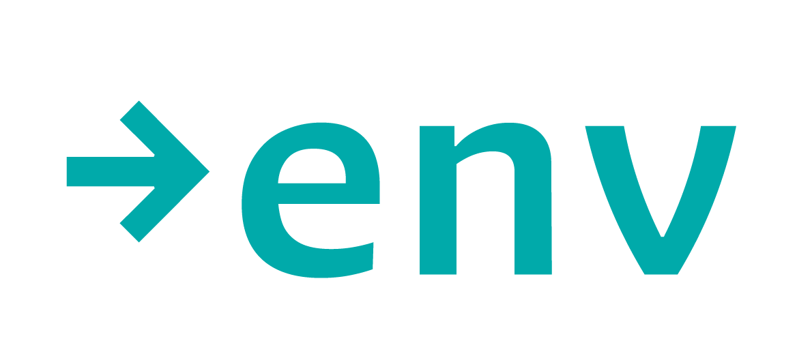

<!-- markdownlint-disable-next-line -->


# direct-env

Load and validate environment variables directly from a channel without mutating `process.env`.

## Features

- 🔒 **Non-mutating**: Reads env vars without touching `process.env`
- ✅ **Validation**: Parse and validate using schemas (Zod, Joi, or native)
- 🔌 **Channel-based**: Load from files, dotenvx, or custom sources
- 🎯 **Type-safe**: Full TypeScript support with inferred types
- 🔧 **Preprocessing**: Normalize values before validation

## Installation

```bash
bun add direct-env
```

## Usage

### Basic Example

```typescript
import { load, schema } from "direct-env";

const env = await load({
  path: ".env",
  root: import.meta.url,
  vars: {
    PORT: schema.number({ default: 3000 }),
    DATABASE_URL: schema.string(),
    DEBUG: schema.boolean({ default: false }),
  }
});

console.log(env.PORT); // number
console.log(env.DATABASE_URL); // string
console.log(env.DEBUG); // boolean
```

### Using EnvMeta

```typescript
import { EnvMeta, load } from "direct-env";

// Create reusable metadata
const meta = new EnvMeta({
  path: ".env.production",
  root: import.meta.url,
  vars: {
    API_KEY: schema.string(),
    MAX_CONNECTIONS: schema.number(),
  }
});

// Load multiple times without recreating metadata
const env1 = await load(meta);
const env2 = await load(meta, { strict: false });
```

### With Zod Schemas

```typescript
import { load } from "direct-env";
import { z } from "zod";

const env = await load({
  path: ".env",
  vars: {
    PORT: z.number().min(1024).max(65535),
    NODE_ENV: z.enum(["development", "production", "test"]),
    API_URL: z.string().url(),
  }
});
```

### With Custom Preprocessing

```typescript
import { load, schema } from "direct-env";

const env = await load(
  {
    path: ".env",
    vars: {
      PERCENTAGE: schema.number(),
      ENABLED: schema.boolean(),
    }
  },
  {
    preprocess: {
      number: (value) => value.replace(/%$/, ""), // Strip % suffix
      bool: (value) => value === "on" ? "true" : value,
    }
  }
);
```

### Using Different Channels

```typescript
import { load } from "direct-env";
import { dotenvx } from "@dotenvx/dotenvx";

// Using dotenvx
const env = await load({
  path: ".env.vault",
  channel: {
    dotenvx,
    get: { privateKey: process.env.DOTENV_PRIVATE_KEY }
  },
  vars: {
    SECRET: schema.string(),
  }
});
```

## API

### `load(meta, options?)`

Load and validate environment variables.

**Parameters:**
- `meta`: `EnvMeta | EnvMetaOptions` - Metadata or options
- `options`: `DirectEnvOptions` - Optional loading configuration
  - `preprocess`: Custom preprocessing functions
  - `strict`: Throw on missing required vars (default: `true`)

**Returns:** `Promise<T>` - Validated environment variables

### `EnvMeta`

Container for environment variable metadata.

**Constructor:**
```typescript
new EnvMeta(options: EnvMetaOptions)
```

**Properties:**
- `channel`: `EnvChannel` - Channel for reading/writing
- `path`: `string` - Fully qualified file path
- `schemas`: `Record<string, EnvVarSchema>` - Resolved schemas
- `preprocess`: `Preprocessors | undefined` - Preprocessing functions

### `EnvMetaOptions`

Configuration for creating EnvMeta.

**Properties:**
- `path`: `string` - Path to env file
- `root`: `string | URL` - Root directory for resolving paths
- `vars`: `Record<string, SupportedSchema>` - Variable schemas
- `channel`: `EnvChannelOptions` - Channel configuration

## Error Handling

```typescript
import { load, MissingEnvVarError, ValidationError } from "direct-env";

try {
  const env = await load({
    path: ".env",
    vars: { PORT: schema.number() }
  });
} catch (error) {
  if (error instanceof MissingEnvVarError) {
    console.error(`Missing: ${error.key}`);
  } else if (error instanceof ValidationError) {
    console.error(`Invalid ${error.key}: ${error.value}`);
  }
}
```

## License

MIT
